# Dental_Appointment_Portal
A dental appointment application with a supporting database that will enable patients to make limited appointments 
at a dental office by using a website that will form the front end. In addition, through an administration login
this application enables staff access to the entire database and provides dentists with the ability to book time off 
or cancel patient appointments.

### Technology Stack

Front-End      | Back-End
---------------|---------
HTML           |  Node.JS
Bootstrap CSS  |  Express
Javascript     |  Handlebars
&nbsp;         |  My SQL

### Database Design

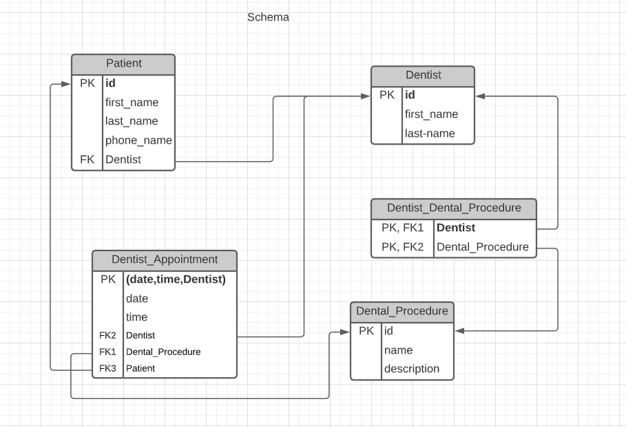

### Screenshots of Website
1. General

    1) Site home page. 

    CRUD: Select from procedure all procedures and their descriptions except for the procedure “Unavailable”.
    
    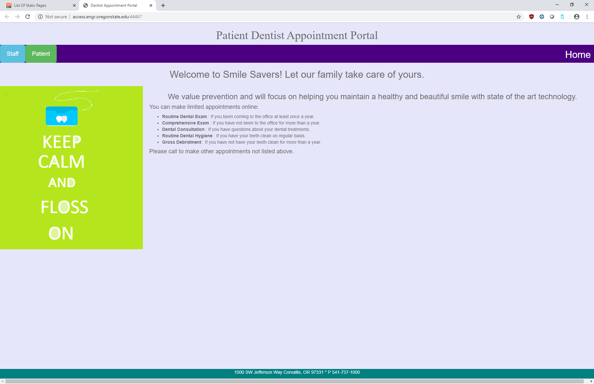 
    
    &nbsp;
    &nbsp;
    
2. For Patients

    1) Patient home page.
    
    CRUD: select from procedure all procedures and their descriptions except for the procedure “Unavailable”.
    
    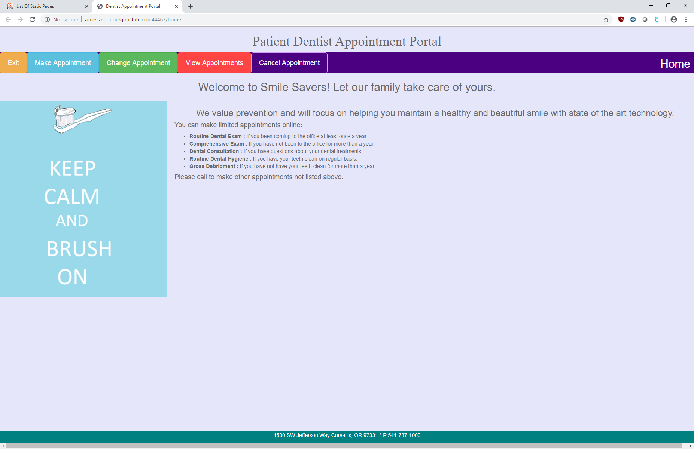    
    
    &nbsp;
    &nbsp;    
    
    2) Make appointment step 1: enter patient account number.
    
    CRUD: select dentist id and patient id (used to verify) using patient account number (patient id).
    
    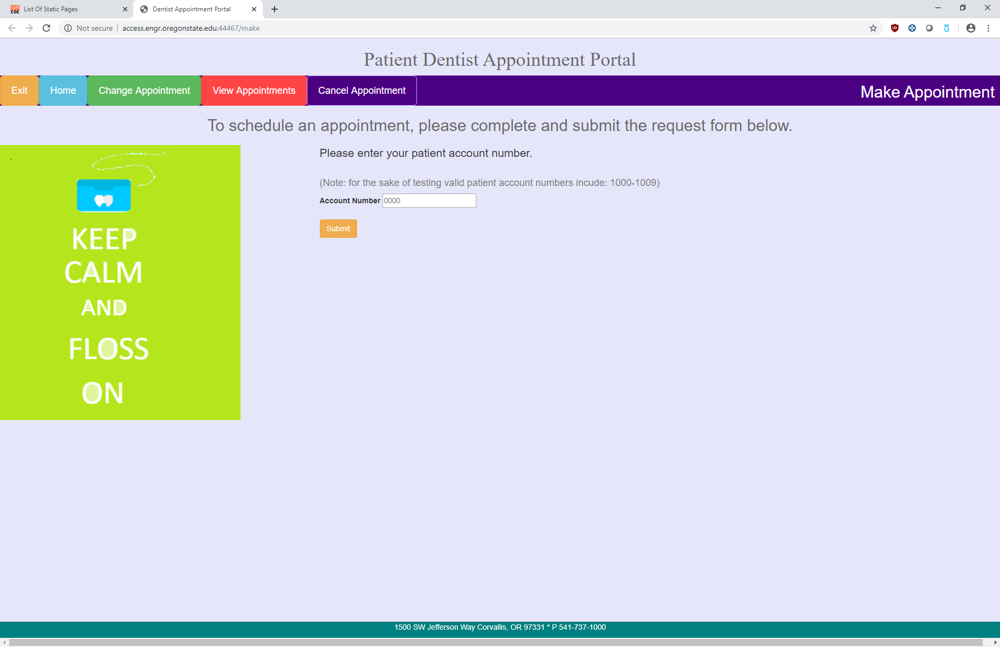
    
    &nbsp;
    &nbsp;    
    
    3) Make appointment step 2: select a procedure.
    
    CRUD: select the procedures that the patient’s dentist performs except for the procedure “unavailable”. 
    
        
    
    &nbsp;
    &nbsp;  
    
    4) Make or change an appointment step 3: select a date. 
    
    No CRUD functionality.    
    
    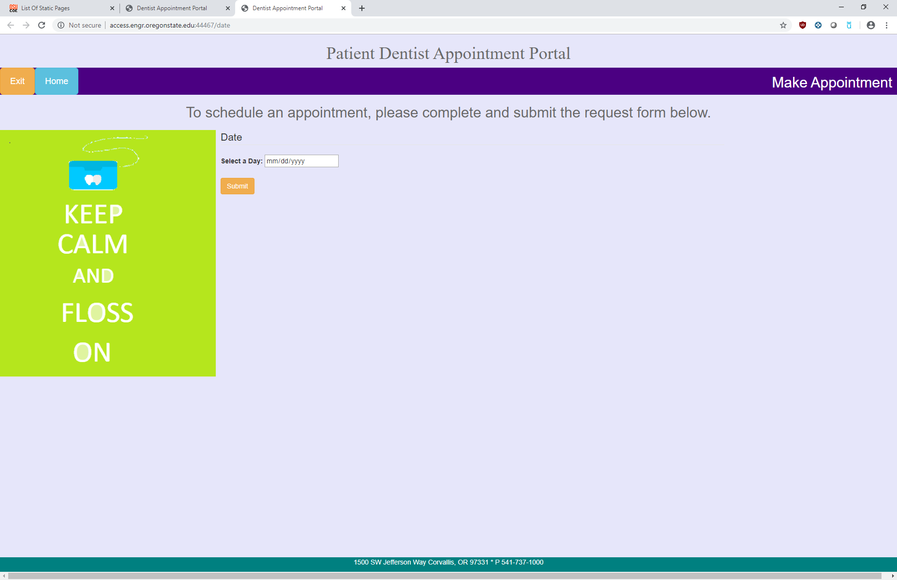  
    
    &nbsp;
    &nbsp;    
    
    5) Make or change an appointment step 4: select the time from a drop-down list.    

    CRUD: select the times (in half hour intervals) that the dentist is unavailable on the given date.
    
    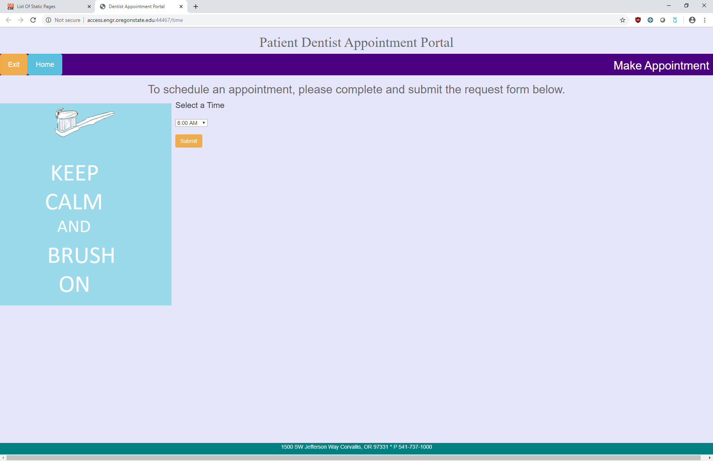  
    
    &nbsp;
    &nbsp;
    
    6) Make or change an appointment step 5: confirmation page.
    
    CRUD:
    For making an appointment: insert into appointment a new appointment with the selected date, time, and procedure and dentist Id and patient account number  (patient Id).
    
    or
    
    For changing an appointment: update appointment and set the time and date to the newly selected time and date where the appointment is identified by the dentist Id and original date and time  
    
    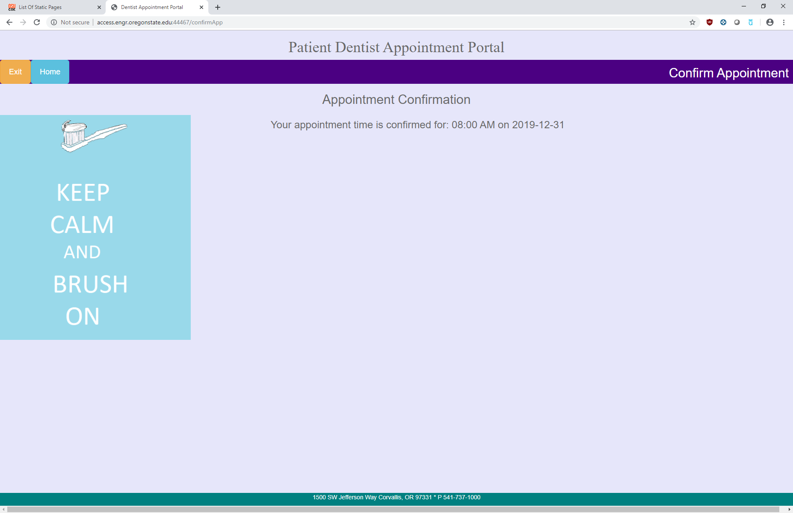  
    
    &nbsp;
    &nbsp;
    
    7) Change an appointment step 1: Enter patient account number.
    
    No CRUD functionality.
    
    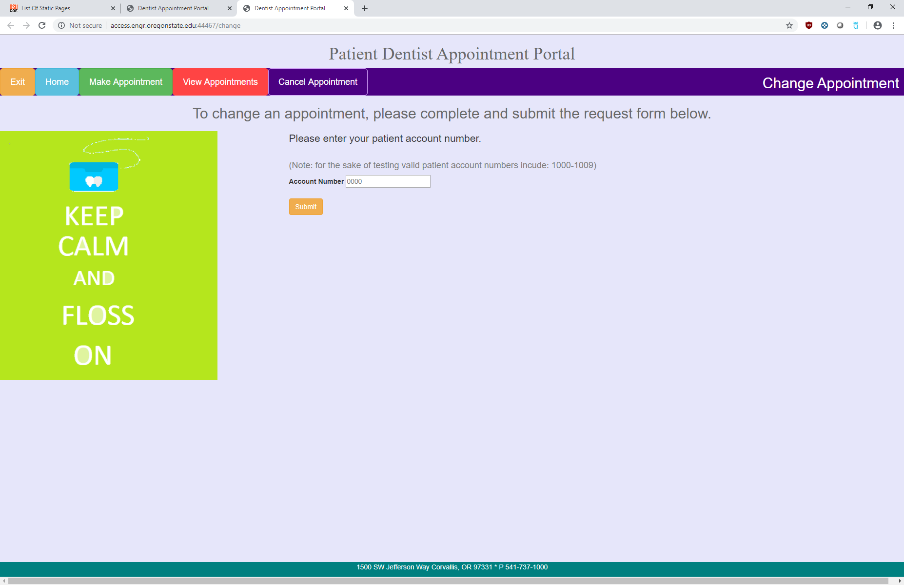  
    
    &nbsp;
    &nbsp;   
    
    8) Change or cancel an appointment step 2: Select an appointment to change or cancel.
    
    CRUD: select appointments from appointment for the patient with the given account number (patient id). 
    
            
       
    &nbsp;
    &nbsp;
    
    9) Cancel an appointment step 1: enter patient account number (patient id). 
    
    No CRUD functionality.  
    
        
    
    &nbsp;
    &nbsp;  
    
    10) Cancel an appointment confirmation page.
    
    CRUD: Delete from appointment the appointment with the specified date, time and dentist Id.   
    
    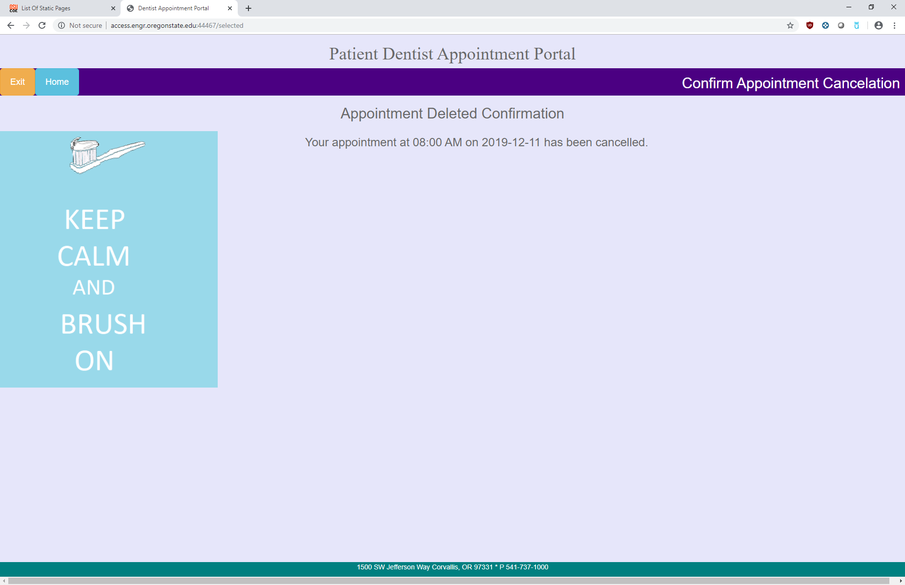
    
    &nbsp;
    &nbsp; 
    
    11) View appointments step 1: enter patient account number.
    
    No CRUD functionality.  
    
    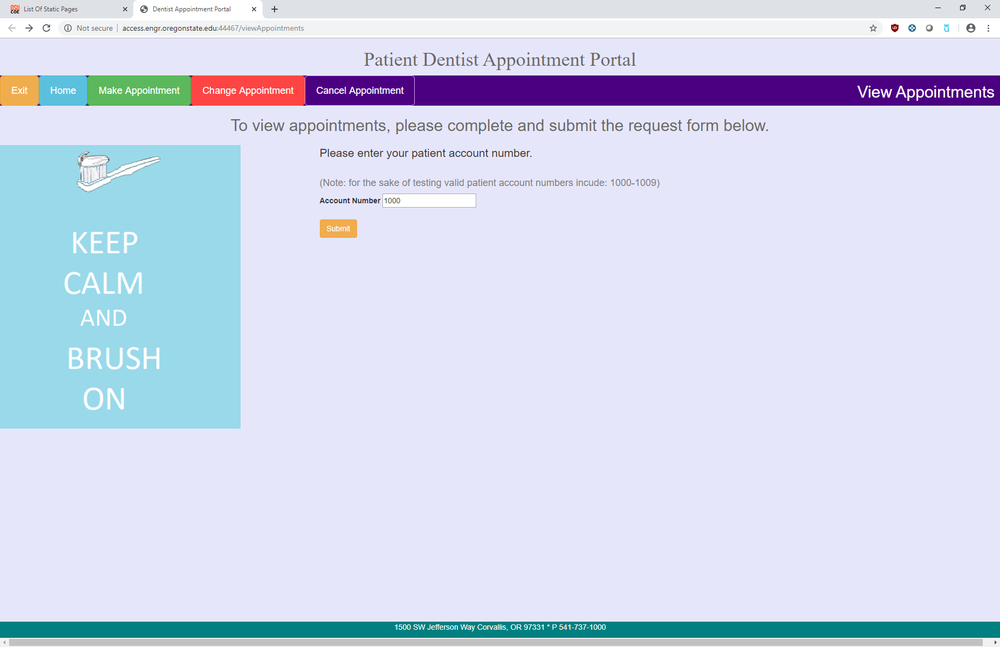    
    
    &nbsp;
    &nbsp;  
    
    12) View appointments table.
    
    CRUD:
    
    1) select the patient’s name based on the patient account number (patient id)
    
    2) select the patient’s appointments from the appointment table and display the dentist’s name too through an inner join    
    
     
    
    &nbsp;
    &nbsp;  
    
3. For Staff

    1) Administrator login. A non-functional login page used to access the administrator side. 
    
    No CRUD functionality.   
    
    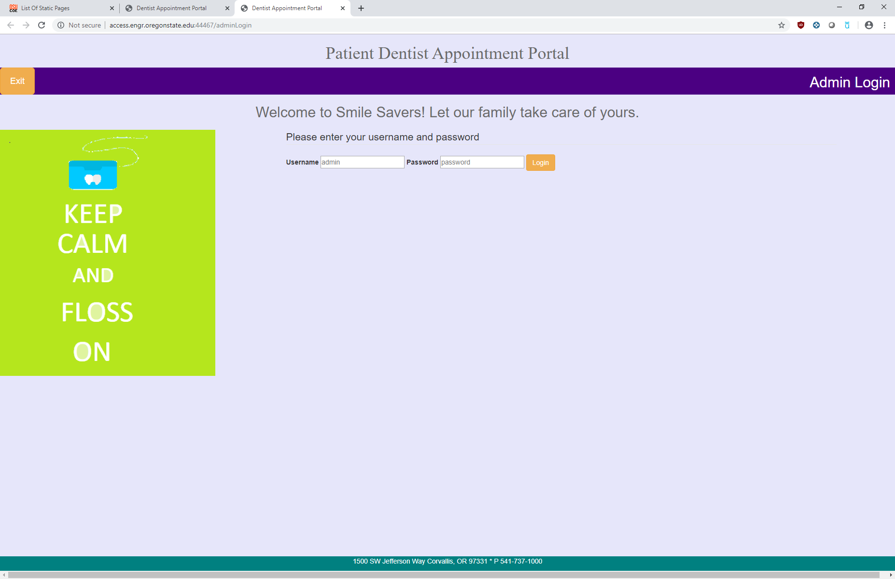 
    
    &nbsp;
    &nbsp;
    
    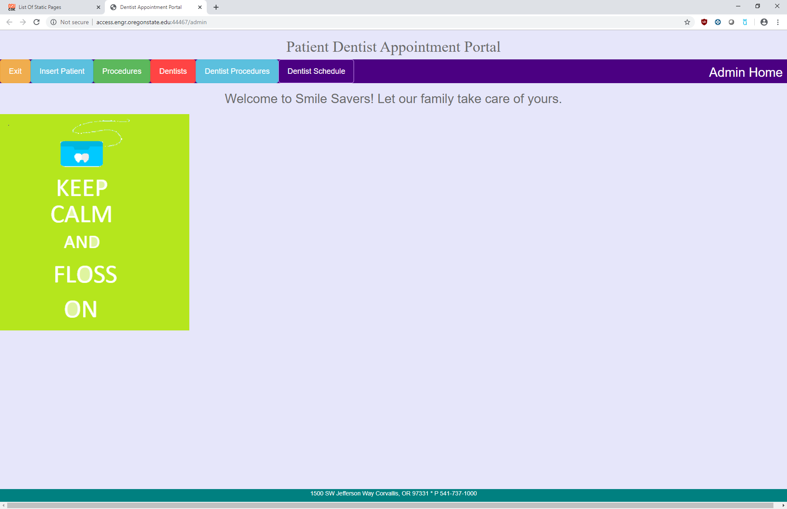

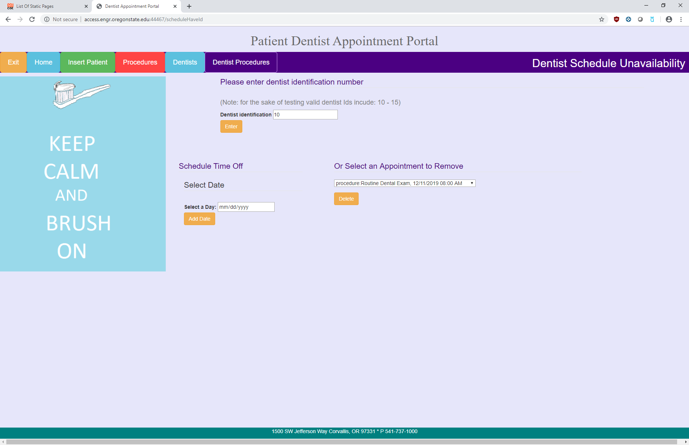  

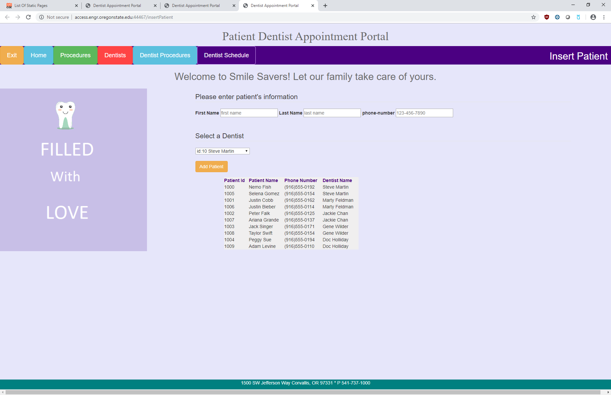 
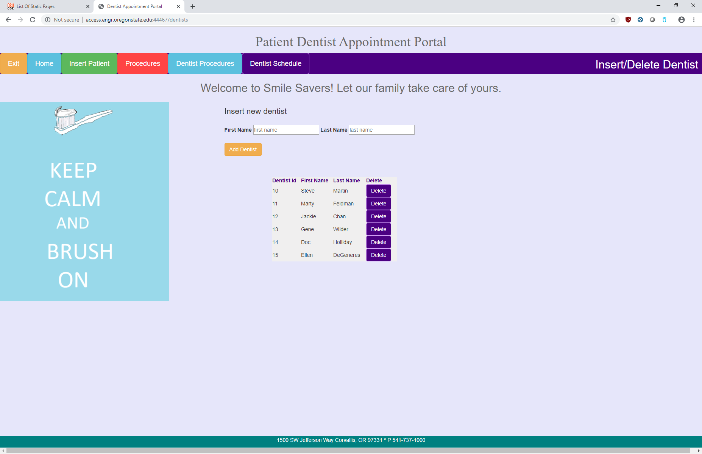 
  
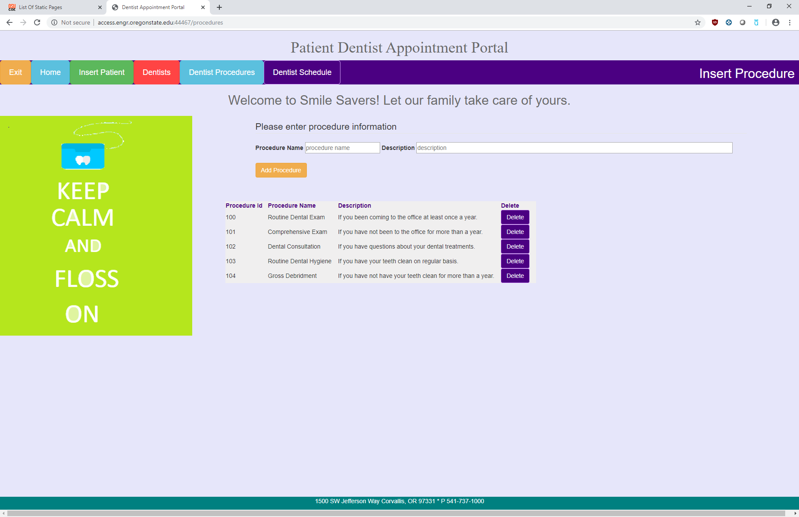                                                                                                                                              
